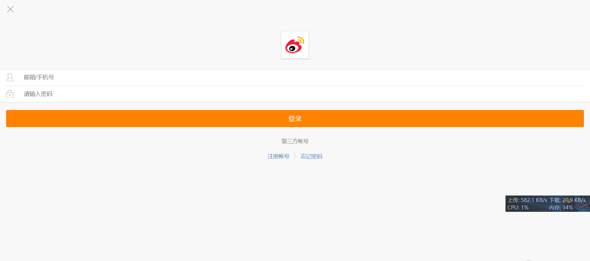
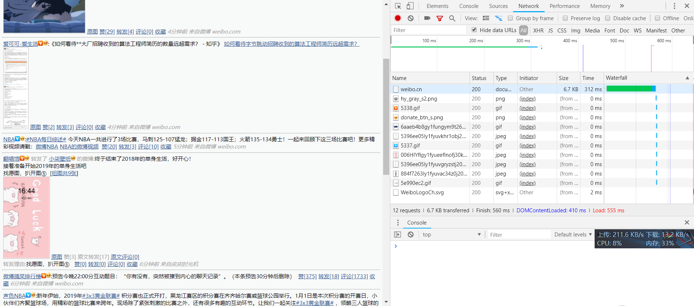
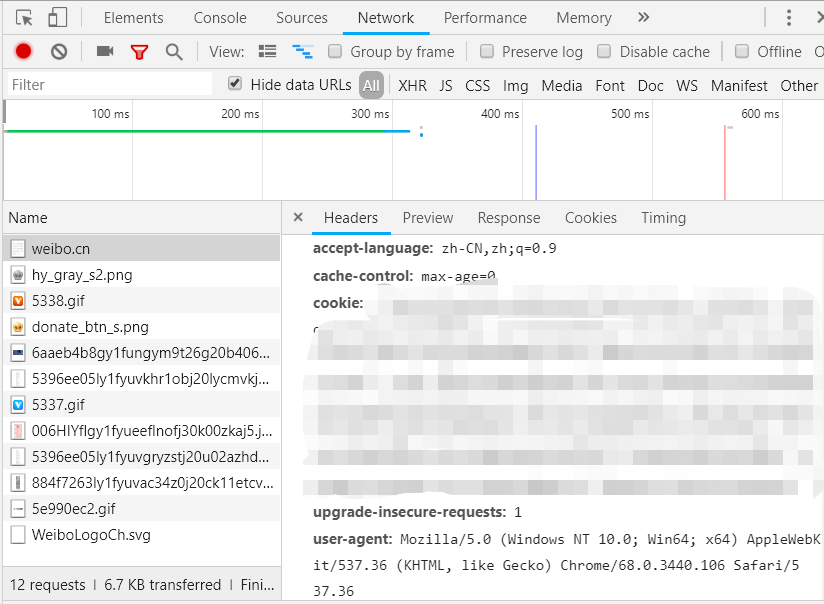

# SianWeiboSpider
Sina Weibo spider /  新浪微博爬虫

# 功能
爬取新浪微博信息：爬取微博信息，并写入文件，文件结果如图所示：


# 输入
用户id，例如新浪微博昵称为“Dear-迪丽热巴”的id为“1669879400”

# 输出
- 用户名：用户昵称，如"张碧晨"
- 微博数：用户的全部微博数（转发微博+原创微博）
- 关注数：用户关注的微博账号数量
- 粉丝数：用户的粉丝数
- 微博内容：以list的形式存储了用户所有微博内容
- 微博位置：以list的形式存储了用户所有微博的发布位置
- 微博发布时间：以list的形式存储了用户所有微博的发布时间
- 微博对应的点赞数：以list的形式存储了用户所有微博对应的点赞数
- 微博对应的转发数：以list的形式存储了用户所有微博对应的转发数
- 微博对应的评论数：以list的形式存储了用户所有微博对应的评论数
- 微博发布工具：以list的形式存储了用户所有微博的发布工具,如iPhone客户端、HUAWEI Mate 20 Pro等
- 结果文件：保存在当前目录的weibo文件夹里，名字为"user_id.txt"的形式

# 运行环境
- 开发语言：python2/python3
- 系统： Windows/Linux

# 使用说明
## 1.下载脚本
```bash
$ git clone https://github.com/wuyang0329/SianWeiboSpider.git
```
运行上述命令，将本项目下载到当前目录，如果下载成功当前目录会出现一个名为"SianWeiboSpider"的文件夹；
## 2.设置cookie和user_id
打开weibospider文件夹下的"**weibospider.py**"文件,将“**your cookie**”替换成爬虫微博的cookie，后面会详细讲解如何获取cookie；将**user_id**替换成想要爬取的微博的user_id，后面会详细讲解如何获取user_id;
## 3.运行脚本
大家可以根据自己的运行环境选择运行方式,Linux可以通过
```bash
$ python SianWeiboSpider.py
```
运行;
## 4.按需求修改脚本（可选）
本脚本是一个Weibo类，用户可以按照自己的需求调用Weibo类。
例如用户可以直接在"weibospider.py"文件中调用Weibo类，具体调用代码示例如下：
```python
user_id = 1677856077
filter = 1
wb = Weibo(user_id,filter) #调用Weibo类，创建微博实例wb
wb.start()  #爬取微博信息
```
user_id可以改成任意合法的用户id（爬虫的微博id除外）；filter默认值为0，表示爬取所有微博信息（转发微博+原创微博），为1表示只爬取用户的所有原创微博；wb是Weibo类的一个实例，也可以是其它名字，只要符合python的命名规范即可；通过执行wb.start() 完成了微博的爬取工作。在上述代码执行后，我们可以得到很多信息：<br>
**wb.username**：用户名；<br>
**wb.weibo_num**：微博数；<br>
**wb.following**：关注数；<br>
**wb.followers**：粉丝数；<br>
**wb.weibo_content**：存储用户的所有微博，为list形式，若filter=1， wb.weibo_content[0]为最新一条**原创**微博，filter=0为最新一条微博，wb.weibo_content[1]、wb.weibo_content[2]分别表示第二新和第三新的微博，以此类推。当然如果用户没有发过微博，则wb.weibo_content为[]；<br>
**wb.weibo_place**: 存储微博的发布位置，为list形式，如wb.weibo_place[0]为最新一条微博的发布位置，与wb.weibo_content[0]对应，如果该条微博没有位置信息，则weibo_place内容为无,其它用法同wb.weibo_content；<br>
**wb.publish_time**: 存储微博的发布时间，为list形式，如wb.publish_time[0]为最新一条微博的发布时间，与wb.weibo_content[0]对应，其它用法同wb.weibo_content；<br>
**wb.up_num**：存储微博获得的点赞数，为list形式，如wb.up_num[0]为最新一条微博获得的点赞数，与wb.weibo_content[0]对应，其它用法同wb.weibo_content；<br>
**wb.retweet_num**：存储微博获得的转发数，为list形式，如wb.retweet_num[0]为最新一条微博获得的转发数，与wb.weibo_content[0]对应，其它用法同wb.weibo_content；<br>
**wb.comment_num**：存储微博获得的评论数，为list形式，如wb.comment_num[0]为最新一条微博获得的评论数，与wb.weibo_content[0]对应，其它用法同wb.weibo_content。<br>
**wb.publish_tool**：存储微博的发布工具，为list形式，如wb.publish_tool[0]为最新一条微博的发布工具，与wb.weibo_content[0]对应，其它用法同wb.weibo_content。


# 如何获取cookie
1.用Chrome打开<https://passport.weibo.cn/signin/login>；<br>
2.输入微博的用户名、密码，登录，如图所示：

登录成功后会跳转到<https://m.weibo.cn>;<br>
3.按F12键打开Chrome开发者工具,在地址栏输入并跳转到<https://weibo.cn>,跳转后会显示如下类似界面:

4.点击Chrome开发者工具“Name"列表中的"weibo.cn",点击"Headers"，其中"Request Headers"下，"Cookie"后的值即为我们要找的cookie值，复制即可，如图所示：


# 如何获取user_id
1.打开网址<https://weibo.cn>，搜索我们要找的人，如”张碧晨“，进入她的主页；<br>
2.大部分情况下，在用户主页的地址栏里就包含了user_id，如”郭碧婷“的地址栏地址为"<https://weibo.cn/u/1677856077?f=search_0>"，其中的"1677856077"就是她的user_id。如图所示：
![image]images/user_id.png)

但是部分用户设置了个性域名，他们的地址栏地址就变成了"<https://weibo.cn/个性域名?f=search_0>"的形式。
事实上，如果仅仅爬取微博，用user_id或个性域名都可以，但是因为本脚本还要爬取用户昵称，而用个性域名表示的网页爬取有一些小问题，需要另外的网页。所以，如果遇到地址栏没有user_id的情况，大家可以点击”资料“，跳转到用户资料页面，如张碧晨的资料页面地址为"<https://weibo.cn/1677856077/info>"，其中的"1677856077"即为张碧晨微博的user_id。如图所示：


# 注意事项
1.user_id不能为爬虫微博的user_id。因为要爬微博信息，必须先登录到某个微博账号，此账号我们姑且称为爬虫微博。爬虫微博访问自己的页面和访问其他用户的页面，得到的网页格式不同，所以无法爬取自己的微博信息；<br>
2.cookie有期限限制，大约有几天的有效期，超过有效期需重新更新cookie。

